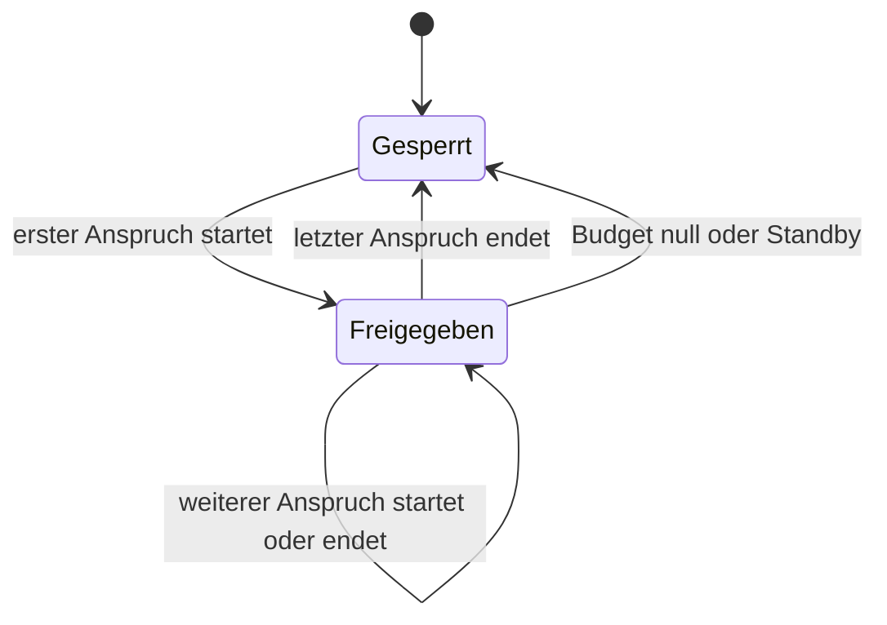
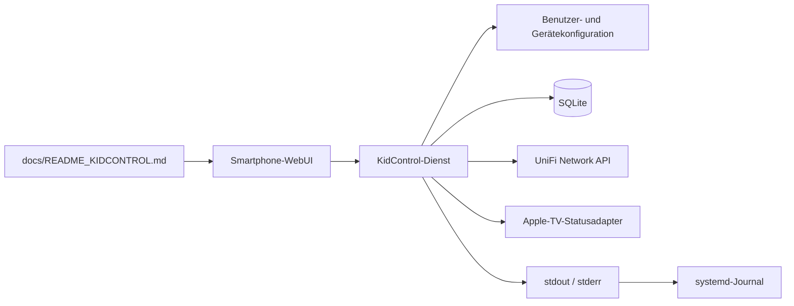

# KidControl – Anforderungen und Architektur

## 1. Ziel

KidControl verwaltet tägliche Zeitbudgets für die Nutzung mehrerer kabelgebundener Apple TVs. Angemeldete Benutzer wählen in einer Smartphone-WebUI ein Gerät und starten oder stoppen ihre Nutzung. Während einer aktiven Sitzung deaktiviert KidControl die dem Apple TV zugeordnete UniFi-ACL-Sperrregel. Ist kein Anspruch mehr aktiv, wird die Regel wieder aktiviert.

Ein Budget darf in beliebig viele Abschnitte und auf verschiedene Apple TVs verteilt werden. Beispiel: Bei einer Stunde Tagesbudget sind 5, 30 und 25 Minuten auf einem oder mehreren Geräten möglich. Abgerechnet wird sekundengenau; die Restzeit erscheint als `hh:mm:ss`.

## 2. Festgelegter Umfang

- zunächst ungefähr zwei, später bis zu zehn verwaltete Geräte;
- nur internes LAN, geplanter FQDN `kidcontrol.tsei.mdn`;
- Zielsystem: schlanke Debian-12- oder Debian-13-VM;
- primär für Smartphones gestaltete WebUI;
- Benutzername aus einer Auswahlliste und vierstellige PIN;
- Anmeldung bleibt bis zum manuellen Logout bestehen;
- Benutzer, PINs, Rollen, Wochenbudgets und Gerätezuordnung in einer Konfigurationsdatei;
- Sitzungen, Verbrauch, Zeitkorrekturen und Laufzeitzustand in einer leichtgewichtigen, Node.js-kompatiblen SQLite-Datenbank;
- Benutzerverwaltung ausschließlich über die Konfigurationsdatei, nicht über die WebUI;
- Superuser-Funktionen über die WebUI;
- Betriebsprotokoll über Standardausgabe/-fehler und damit ohne spezielle Node.js-Syslog-Bibliothek im systemd-Journal; zusätzliche Logdateien bleiben optional.

Die Klartext-PINs sind eine bewusste Vereinfachung für das interne Netz. Der wesentlich mächtigere UniFi-API-Key darf trotzdem niemals in Quellcode, Benutzerkonfiguration oder Git stehen.

## 3. UniFi-Schnittstelle

### Verifiziertes Prinzip

Das vorhandene und bereits praktisch getestete Skript verwendet die offizielle lokale UniFi Network Integration API:

- Basisroute: `/proxy/network/integration/v1/sites/{siteId}`;
- Authentifizierung: API-Key im HTTP-Header `X-API-Key`;
- ACL-Liste: `GET /acl-rules`;
- ACL-Änderung: `PUT /acl-rules/{aclRuleId}`;
- aktivierte Sperrregel: Apple TV gesperrt;
- deaktivierte Sperrregel: Apple TV freigegeben.

KidControl soll die bestehende ACL-Struktur nicht erzeugen oder löschen, sondern nur ausdrücklich konfigurierte Regeln lesen und deren Feld `enabled` ändern. Anzeigenamen und ACL-Regeln werden explizit miteinander verknüpft. Damit erscheinen keine beliebigen Netzwerkregeln in der WebUI.

Beispiel einer noch nicht finalen Gerätekonfiguration:

```json
{
  "devices": [
    {
      "id": "living-room",
      "displayName": "Wohnzimmer",
      "aclRuleName": "KC AppleTV Wohnzimmer",
      "appleTvIdentifier": "noch-festzulegen"
    }
  ]
}
```

### API-Konfiguration

Zur Laufzeit werden mindestens diese Werte benötigt:

- UniFi-Host;
- Site-ID;
- neuer UniFi-API-Key aus einer geschützten Secret-/Environment-Datei.

Der bereits übermittelte Schlüssel gilt als offengelegt und muss vor einer späteren Inbetriebnahme widerrufen und ersetzt werden. Konkreter Host, Site-ID und Schlüssel werden nicht in das Repository übernommen.

### Quellen

- [Ubiquiti: Getting Started with the Official UniFi API](https://help.ui.com/hc/en-us/articles/30076656117655-Getting-Started-with-the-Official-UniFi-API)
- [UniFi Developer Portal: Network API](https://developer.ui.com/network/)
- Die exakt zur installierten Network-Version passende Dokumentation und API-Key-Verwaltung befindet sich zusätzlich lokal unter **UniFi Network → Control Plane → Integrations**.

## 4. Zeit- und Policy-Modell

### Tagesbudget

- Jeder normale Benutzer besitzt je einen Vorgabewert für Montag bis Sonntag.
- Eingabe der Vorgaben als Stunden und Minuten.
- Abrechnung intern sekundengenau.
- Tagesgrenze ist Mitternacht in der Zeitzone `Europe/Berlin` einschließlich CET/CEST-Wechsel.
- Nicht verbrauchte Zeit verfällt an der Tagesgrenze.
- Ferien und andere Ausnahmen werden manuell über Konfiguration oder Tageskorrektur behandelt.

Effektive Restzeit:

```text
Rest = Tagesvorgabe + heutige Superuser-Korrektur - heutiger Verbrauch
```

Der Wert wird für normale Benutzer nicht negativ. Erreicht er null, beendet KidControl die laufende Sitzung sofort.

### Superuser

Ein Superuser:

- besitzt unbegrenzte Nutzungszeit;
- kann die heutige Restzeit eines normalen Benutzers direkt auf `00:00` bis `24:59` einstellen;
- kann Zeit damit hinzufügen, reduzieren, vollständig streichen oder zurückgeben;
- bedient Stunden und Minuten bevorzugt über animierte Scroll-Auswahlelemente;
- kann einen manuellen „KidControl-Zustand wiederherstellen“-Reset auslösen;
- verdrängt normale Sitzungen am gewählten Apple TV.

Verdrängte normale Sitzungen werden pausiert und nicht automatisch fortgesetzt. Nach Ende der Superuser-Nutzung muss ein normaler Benutzer erneut **Start** drücken.

## 5. Mehrbenutzer- und Gerätezustand

### Ansprüche statt bloßer ACL-Zustände

Die ACL kennt nur gesperrt oder freigegeben. KidControl verwaltet deshalb zusätzlich pro Benutzer einen eigenen Nutzungsanspruch:

- Ein Benutzer darf höchstens einen aktiven Anspruch besitzen.
- Wählt er ein zweites Gerät, endet sein Anspruch am ersten Gerät sofort.
- Das erste Gerät wird nur dann gesperrt, wenn dort kein weiterer Anspruch aktiv ist.
- Mehrere normale Benutzer dürfen gleichzeitig Ansprüche auf dasselbe Apple TV besitzen.
- Jeder dieser Benutzer verbraucht während seines eigenen aktiven Anspruchs sein eigenes Budget.
- Ein Benutzer kann nur seinen eigenen Anspruch stoppen.
- Die ACL bleibt deaktiviert, solange mindestens ein zulässiger Anspruch besteht.
- Die WebUI weist nicht besonders darauf hin, wenn das Gerät bereits durch einen anderen Benutzer freigeschaltet ist.



### Wechsel des Apple TV

Beim Wechsel eines Benutzers:

1. bisherige Sitzung sekundengenau abrechnen und beenden;
2. alte ACL aktivieren, falls dort kein anderer Anspruch besteht;
3. Budget prüfen;
4. neuen Anspruch speichern;
5. neue ACL deaktivieren;
6. Ergebnis über die UniFi API zurücklesen.

Die Datenbankänderung und der externe ACL-Aufruf können nicht in einer gemeinsamen Transaktion liegen. Deshalb braucht die Implementierung einen nachvollziehbaren Soll-/Ist-Abgleich und idempotente Wiederholungen.

## 6. Standby-Erkennung

Ein Apple TV kann im Ruhezustand weiterhin im Netzwerk als online erscheinen. Ein reiner Ping oder UniFi-Online-Status ist daher nicht ausreichend. Als bevorzugter Prüfweg wird [`pyatv`](https://pyatv.dev/) untersucht.

Vorgesehenes Verhalten:

- Standby beendet die betroffenen normalen Sitzungen;
- die bis dahin verbrauchte Zeit wird sekundengenau gespeichert;
- die ACL wird aktiviert, sobald kein anderer Anspruch mehr besteht;
- Aufwachen startet keine Sitzung automatisch;
- der Benutzer muss erneut **Start** drücken.

Wichtige Einschränkung: Laut `pyatv` wird der Power-State teilweise aus verbundenen Ausgabegeräten abgeleitet und kann beispielsweise mit HomePods oder externen Audiogeräten unzuverlässig sein. Vor der endgültigen Architektur ist daher ein Test mit den tatsächlich eingesetzten Apple TVs erforderlich. Der Test muss Erkennung, einmaliges Pairing, gespeicherte Credentials, Reaktionszeit und Verhalten mit den vorhandenen Audioausgaben prüfen.

## 7. Anmeldung und Benutzerkonfiguration

Vorgesehene, noch nicht finale Struktur:

```json
{
  "timezone": "Europe/Berlin",
  "users": [
    {
      "id": "user-1",
      "displayName": "Benutzer 1",
      "pin": "1234",
      "role": "user",
      "weeklyBudgetMinutes": {
        "monday": 60,
        "tuesday": 60,
        "wednesday": 60,
        "thursday": 60,
        "friday": 60,
        "saturday": 120,
        "sunday": 120
      }
    }
  ]
}
```

Die Beispiel-PIN ist kein produktiver Zugangswert. Vor der Implementierung werden Schema, Dateipfad und Validierungsregeln verbindlich festgelegt.

Die Sitzung verwendet ein zufälliges, serverseitig widerrufbares Cookie mit mindestens `HttpOnly` und `SameSite=Strict`. „Bis zum Logout“ bedeutet eine langlebige Anmeldung, aber keine Speicherung der PIN im Browser. Eine PIN-Änderung oder Benutzerentfernung muss bestehende Sitzungen widerrufen können.

## 8. Persistenz und Neustart

SQLite speichert mindestens:

- abgeschlossene und aktive Nutzungssitzungen;
- Start-, Stopp- und Abrechnungszeitpunkte;
- Tagesverbrauch je Benutzer;
- Superuser-Korrekturen mit Zeitpunkt und Urheber;
- aktiven Anspruch je Benutzer und Apple TV;
- zuletzt bekannten und gewünschten ACL-Zustand;
- externe Zustandsübernahmen und manuelle Resets.

Beim Neustart gilt die zustandsorientierte Wiederherstellung:

1. gespeicherte aktive Sitzungen laden und bis zum Neustartzeitpunkt abrechnen;
2. Tagesgrenze und Restbudgets prüfen;
3. aktuellen Zustand aller verwalteten ACLs lesen;
4. gespeicherte gültige Ansprüche fortsetzen;
5. ACLs entsprechend dem wiederhergestellten Zustand setzen;
6. das Ergebnis erneut lesen und protokollieren.

Für einen längeren Dienstausfall muss vor der Implementierung im Machbarkeitstest festgelegt werden, ob die Zeit bis zum Neustart vollständig als Nutzung zählt. Die sicherere Budgetregel ist: Eine zuvor aktive Sitzung zählt weiter, bis KidControl den Standby oder einen Stopp sicher feststellen kann.

## 9. Externe ACL-Änderungen

Im normalen Betrieb übernimmt KidControl eine außerhalb der Anwendung vorgenommene ACL-Änderung als Istzustand und protokolliert sie. Es überschreibt sie nicht sofort. Daraus folgt:

- extern gesperrt: betroffene lokale Ansprüche stoppen und abrechnen;
- extern freigegeben ohne Anspruch: als externe Freigabe markieren, aber keinem Benutzer Zeit berechnen;
- danach ist die Datenbank der neue dokumentierte Zustand.

Ein Superuser kann über **KidControl-Zustand wiederherstellen** bewusst die Gegenrichtung auslösen: gültige lokale Ansprüche und Policies werden ausgewertet und die verwalteten ACLs auf diesen Sollzustand gesetzt.

## 10. Vorgeschlagene Architektur



Empfohlene Aufteilung:

- JavaScript/Node.js für HTTP-API, WebUI, Authentifizierung, Zeitlogik und UniFi-Zugriff;
- SQLite als einzelne lokale Datenbankdatei;
- kleiner lokaler `pyatv`-Adapter nur dann, wenn der Gerätetest zuverlässige Standby-Signale liefert;
- systemd für Start, Neustart und Journal-Logging;
- möglichst wenige Frameworks und keine separate Datenbank oder Queue.

Node.js kann ohne spezielle Syslog-Abhängigkeit in stdout/stderr schreiben. Ein systemd-Service übernimmt diese Ausgaben automatisch ins Journal; Betrieb und Rotation bleiben damit Aufgabe der vorhandenen Debian-Werkzeuge.

## 11. Noch bewusst offene Technikentscheidungen

Vor produktivem Code sind kleine Machbarkeitstests vorgesehen:

1. **Standby:** `pyatv` mit den realen Geräten koppeln und Schlaf-/Wachzustand prüfen.
2. **SQLite:** modernes eingebautes `node:sqlite` gegen eine etablierte Node.js-SQLite-Bibliothek abwägen. Ziel ist Debian-12-Kompatibilität bei minimalem Installationsaufwand.
3. **Webstack:** frameworkarme Server-/Frontend-Lösung gegen einen kleinen etablierten Stack abwägen.
4. **UniFi-Test:** mit einem neu erzeugten temporären API-Key Lesen, Umschalten und Zurücklesen einer ausdrücklich benannten Test-ACL prüfen.
5. **Ausfallfenster:** Verhalten bei Dienststillstand, Mitternacht und Zeitumstellung praktisch testen.

Es wird JavaScript und kein TypeScript verwendet. Erst nach diesen Tests werden `package.json`, Abhängigkeiten und Installationsanleitung verbindlich festgelegt.

## 12. Dokumentation in der WebUI

Die WebUI soll diese Datei als HTML rendern. Im Repository zeigt

`code/public/docs/README_KIDCONTROL.md`

als relativer Symlink direkt auf diese Quelldatei. Dadurch gibt es keine zweite, manuell zu pflegende Kopie. Der spätere Webserver bzw. Build-Prozess muss Symlinks ausdrücklich unterstützen; andernfalls liest der Server die Datei direkt aus `docs/`.

## 13. Akzeptanzkriterien für eine spätere erste Version

- Login per Benutzerwahl und vierstelliger PIN;
- langlebige Sitzung bis zum Logout;
- Start, Stopp und Wechsel eines Apple TV;
- sekundengenaue, geräteübergreifende Budgetabrechnung;
- sieben Tagesbudgets pro Benutzer;
- automatische Beendigung bei zuverlässig erkanntem Standby;
- korrekte Mehrbenutzer-Ansprüche auf demselben Gerät;
- sofortiges Stoppen bei Restzeit null;
- Superuser-Nutzung, Zeitkorrektur, Verdrängung und Reset;
- Wiederherstellung nach Neustart;
- Übernahme und Protokollierung externer ACL-Änderungen;
- keine Secrets im Repository;
- Darstellung dieser Dokumentation in der WebUI.
