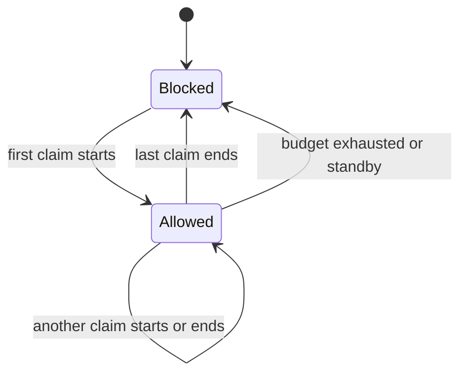

# KidControl — Requirements and Architecture

## 1. Objective

KidControl manages daily usage budgets for multiple wired Apple TVs. Authenticated users select a device in a smartphone WebUI and start or stop their usage. During an active session, KidControl disables the UniFi ACL rule that blocks the selected Apple TV. The rule is enabled again when no active claim remains.

A budget can be split into any number of intervals and used across different Apple TVs. For example, a one-hour daily budget can be consumed in sessions of 5, 30, and 25 minutes on one or more devices. Usage is charged with one-second precision, and the remaining time is displayed as `hh:mm:ss`.

The initial-release TypeScript implementation now exists under `code/`. Automated tests cover the policy engine, persistence, UniFi contract, Apple TV adapter behavior, authentication, HTTP API, and restart-sensitive regressions with fake external adapters. Production deployment still requires the live validation checklist in this document.

## 2. Defined Scope

- initially approximately two, eventually up to ten managed devices;
- internal LAN access only, with the planned FQDN `kidcontrol.tsei.mdn`;
- a lightweight Debian 12 or Debian 13 VM as the target system;
- a WebUI designed primarily for smartphones;
- username selection from a list and a four-digit PIN;
- authentication remains valid until the user logs out manually;
- users, PINs, roles, weekly budgets, and device mappings stored in a configuration file;
- sessions, usage, time adjustments, and runtime state stored in a lightweight, Node.js-compatible SQLite database;
- user administration exclusively through the configuration file, not through the WebUI;
- superuser functions provided through the WebUI;
- operational logging to standard output/error and therefore to the systemd journal without a dedicated Node.js syslog library; additional log files remain optional.

Clear-text PINs are a deliberate simplification for the internal network. The significantly more powerful UniFi API key must nevertheless never be stored in source code, user configuration, or Git.

## 3. UniFi Interface

### Verified Approach

The existing, successfully tested script uses the official local UniFi Network Integration API:

- base route: `/proxy/network/integration/v1/sites/{siteId}`;
- authentication: API key in the `X-API-Key` HTTP header;
- list ACL rules: `GET /acl-rules`;
- update an ACL rule: `PUT /acl-rules/{aclRuleId}`;
- enabled blocking rule: Apple TV is blocked;
- disabled blocking rule: Apple TV is allowed network access.

KidControl must not create or delete the existing ACL structure. It only reads explicitly configured rules and changes their `enabled` field. Display names and ACL rules are mapped explicitly so that unrelated network rules never appear in the WebUI.

Example of a preliminary device configuration:

```json
{
  "devices": [
    {
      "id": "living-room",
      "displayName": "Living Room",
      "aclRuleName": "KC AppleTV Living Room",
      "appleTvIdentifier": "to-be-defined"
    }
  ]
}
```

### API Configuration

The runtime requires at least:

- the UniFi host;
- the site ID;
- a new UniFi API key supplied through a protected secret or environment file.

The previously submitted key must be treated as exposed and revoked before deployment. The specific host, site ID, and API key will not be stored in the repository.

### Sources

- [Ubiquiti: Getting Started with the Official UniFi API](https://help.ui.com/hc/en-us/articles/30076656117655-Getting-Started-with-the-Official-UniFi-API)
- [UniFi Developer Portal: Network API](https://developer.ui.com/network/)
- Documentation matching the installed Network version and API key management are also available locally under **UniFi Network → Control Plane → Integrations**.

## 4. Time and Policy Model

### Daily Budget

- Every regular user has one default budget for each day from Monday through Sunday.
- Defaults are entered as hours and minutes.
- Internal accounting uses one-second precision.
- The day changes at midnight in the `Europe/Berlin` time zone, including CET/CEST transitions.
- Unused time expires at the end of the day.
- Holidays and other exceptions are handled manually through configuration or a daily adjustment.

Effective remaining time:

```text
Remaining = daily default + today's superuser adjustment - today's usage
```

The value never becomes negative for regular users. When it reaches zero, KidControl immediately ends any active session.

### Superusers

A superuser:

- has unlimited usage time;
- can set a regular user's remaining time for the current day directly from `00:00` through `24:59`;
- can therefore add, reduce, remove completely, or restore time;
- preferably selects hours and minutes with animated scrolling controls;
- can trigger a manual **Restore KidControl State** reset;
- displaces regular sessions on the selected Apple TV.

Displaced regular sessions are paused and are not resumed automatically. Once superuser usage ends, a regular user must press **Start** again.

## 5. Multi-User and Device State

### Claims Instead of ACL State Alone

An ACL only represents blocked or allowed network access. KidControl therefore maintains an individual usage claim for each user:

- A user can have at most one active claim.
- Selecting a second device immediately ends that user's claim on the first device.
- The first device is blocked only if no other active claim remains there.
- Multiple regular users may hold claims on the same Apple TV at the same time.
- Each of these users consumes their own budget while their claim is active.
- A user can stop only their own claim.
- The ACL remains disabled while at least one valid claim exists.
- The WebUI does not explicitly indicate that another user has already enabled the device.



### Switching Apple TVs

When a user switches devices:

1. charge and close the previous session with one-second precision;
2. enable the old ACL if no other claim remains there;
3. verify the remaining budget;
4. persist the new claim;
5. disable the new ACL;
6. read the result back through the UniFi API.

The database update and external ACL request cannot share a transaction. The implementation therefore needs a traceable desired/actual-state reconciliation process and idempotent retries.

## 6. Standby Detection

An Apple TV can remain online from a network perspective while sleeping. Ping and the UniFi online state are therefore insufficient. KidControl will use the separately maintained TypeScript fork of [`node-appletv-remote`](https://github.com/tseiman/node-appletv-remote) to observe Companion Link `SystemStatus` and `TVSystemStatus` events without a Python runtime.

Required behavior:

- Standby ends the affected regular sessions.
- Usage up to that point is stored with one-second precision.
- The ACL is enabled as soon as no other claim remains.
- Waking the Apple TV does not restart a session automatically.
- The user must press **Start** again.
- A missing, unsupported, or disconnected signal is `unknown` and must never be interpreted as standby.

The adapter maps a confirmed Companion `Asleep` state to `off`; `Awake`, `Idle`, and `Screensaver` map to `on`. Some tvOS releases do not implement the initial `FetchAttentionState` request, so pushed status events remain authoritative. The underlying library has been validated on one physical Apple TV, including live sleep/wake transitions. KidControl deployment must repeat the end-to-end test for every configured device and tvOS generation. The test covers discovery, initial pairing, protected credential storage, credential reload after restart, initial-state availability, event response time, disconnect/reconnect behavior, and the existing audio outputs.

## 7. Authentication and User Configuration

Preliminary structure:

```json
{
  "timezone": "Europe/Berlin",
  "users": [
    {
      "id": "user-1",
      "displayName": "User 1",
      "pin": "1234",
      "role": "user",
      "weeklyBudgetMinutes": {
        "monday": 60,
        "tuesday": 60,
        "wednesday": 60,
        "thursday": 60,
        "friday": 60,
        "saturday": 120,
        "sunday": 120
      }
    }
  ]
}
```

The example PIN is not a production credential. The implemented schema is represented by `config/config.example.json`; production configuration is stored outside Git with mode `0600` and service-user ownership.

Authentication uses a 256-bit random, server-side revocable token. Only its SHA-256 digest is stored. The browser receives a long-lived `Secure`, `HttpOnly`, `SameSite=Strict`, `__Host-` cookie; PINs are never stored in the browser. A keyed HMAC fingerprint using an independent protected authentication pepper invalidates sessions after a PIN or role change, and removing a user invalidates their sessions. Login attempts are throttled independently by source and normalized user ID.

## 8. Persistence and Restart

SQLite stores at least:

- completed and active usage sessions;
- start, stop, and accounting timestamps;
- daily usage per user;
- superuser adjustments with timestamp and author;
- the active claim for each user and Apple TV;
- the last known and desired ACL state;
- adopted external states and manual resets.

State-oriented recovery applies after a restart:

1. load stored active sessions and charge usage up to the restart time;
2. check the day boundary and remaining budgets;
3. read the current state of all managed ACLs;
4. continue valid stored claims;
5. set ACLs according to the recovered state;
6. read back and log the result.

For a service outage, an active claim is conservatively charged continuously until restart because no reliable stop or standby observation exists during the outage. Accounting is split at every `Europe/Berlin` midnight. If a regular budget expires during downtime, the session ends at the exact calculated exhaustion second rather than at restart time.

## 9. External ACL Changes

During normal operation, KidControl adopts an ACL change made outside the application as the actual state and logs it. It does not immediately overwrite the change. Consequently:

- externally blocked: stop and account for affected local claims;
- externally allowed without a claim: record an external allowance without charging any user's time;
- the database then contains the newly documented state.

A superuser can deliberately apply the opposite direction with **Restore KidControl State**: KidControl evaluates valid local claims and policies and sets managed ACLs to the resulting desired state.

## 10. Proposed Architecture


Recommended division:

- TypeScript/Node.js for the HTTP API, WebUI, authentication, time logic, and UniFi access;
- SQLite as a single local database file;
- the separately maintained `node-appletv-remote` fork as a regular TypeScript dependency for Apple TV Companion power-state signals;
- systemd for startup, restarts, and journal logging;
- as few frameworks as practical, with no separate database server or queue.

Node.js can write to stdout/stderr without a dedicated syslog dependency. A systemd service automatically captures this output in the journal, leaving operation and rotation to the existing Debian tools.

## 11. Implemented Technical Decisions and Remaining Live Validation

The initial release uses:

1. **Runtime:** TypeScript on Node.js `>=22.12.0`.
2. **Persistence:** built-in `node:sqlite`, foreign keys, WAL, `synchronous=FULL`, a busy timeout, schema versioning, and restrictive file modes.
3. **Web stack:** framework-light `node:http` with a dependency-free HTML/CSS/JavaScript frontend.
4. **Apple TV:** `node-appletv-remote` directly from the maintained GitHub fork through `package.json`; no Python process or Git submodule.
5. **Security:** HTTPS-only public and UniFi origins, a TLS reverse proxy, secure host-bound cookies, CSRF Origin validation, persistent login throttling, and protected runtime files.
6. **Recovery:** conservative downtime accounting and serialized desired/actual reconciliation with durable pending state.

Remaining live validation before production use:

1. verify every configured Apple TV, tvOS version, and audio-output configuration;
2. create a new restricted UniFi API key and validate every exact ACL mapping;
3. validate the chosen reverse proxy and internal CA chain;
4. exercise restart, controller outage, external ACL changes, and manual restore on the deployment VM;
5. verify service-user ownership, mode `0600` secrets, systemd sandboxing, backup, and restore.

The reverse proxy is an explicit trust boundary: its address is configured as `TRUSTED_PROXY_IP`, and it must overwrite `X-Forwarded-For` with exactly one validated client address. This preserves per-source login throttling without trusting headers from direct clients.

## 12. Documentation in the WebUI

The WebUI will render this file as HTML. The deployment process copies this source file into the documentation server's content directory; no documentation symlink is maintained inside the project.

## 13. Initial-Release Acceptance Criteria

- Login through username selection and a four-digit PIN.
- Long-lived authentication until logout.
- Start, stop, and switch an Apple TV.
- Per-second, cross-device budget accounting.
- Seven daily defaults per user.
- Automatic termination when standby is reliably detected.
- Correct multi-user claims on the same device.
- Immediate termination when remaining time reaches zero.
- Superuser usage, time adjustments, displacement, and reset.
- Recovery after restart.
- Adoption and logging of external ACL changes.
- No secrets in the repository.
- Display of this documentation in the WebUI.

The repository implementation and automated fake-adapter tests satisfy these software criteria. Production acceptance additionally requires the live validation steps in Section 11 and `code/README_CODE.md`.
